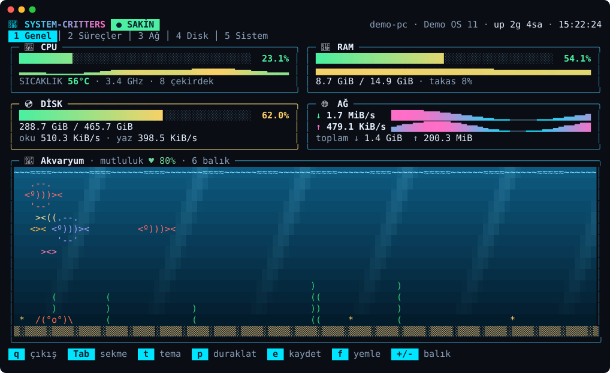
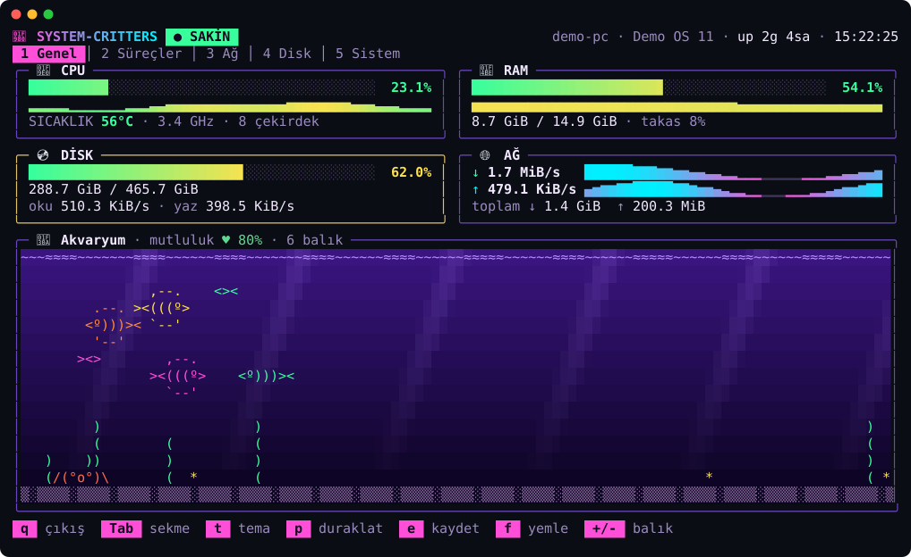
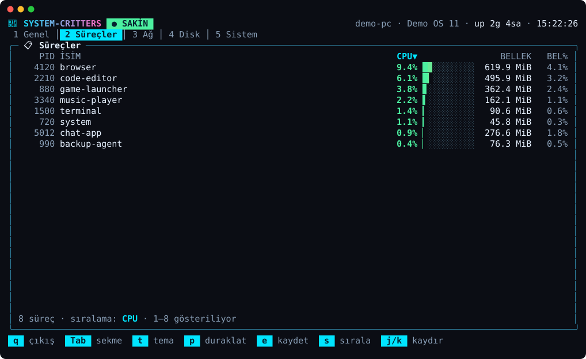

# 🦀 system-critters

Terminalde çalışan renkli bir sistem monitörü. Bilgisayarının CPU, RAM, disk ve
ağ durumunu canlı gösterir. Altında küçük bir akvaryum var: balıklar sistemin
durumuna göre davranır (CPU yükselince hızlanır, RAM doluyorsa sürü büyür).



## Çalıştırma

[Go](https://go.dev/dl/) 1.24 veya üstü gerekir.

```bash
git clone https://github.com/mhmtemnbgr1/ILDA.git
cd ILDA
go run .
```

## Neler var?

- **5 sekme:** Genel, Süreçler, Ağ, Disk, Sistem
- **4 tema:** Okyanus, Neon, Retro, Şeker
- Canlı grafikler, süreç listesi, GPU ve pil bilgisi
- Etkileşimli akvaryum (balıkları yemleyebilirsin)

## Tuşlar

| Tuş | Ne yapar |
|-----|----------|
| `Tab` veya `1`–`5` | sekme değiştir |
| `t` | tema değiştir |
| `p` | duraklat |
| `f` | balıkları yemle |
| `e` | anlık durumu JSON olarak kaydet |
| `q` | çıkış |

Süreçler sekmesinde `s` ile sıralama, `j`/`k` ile kaydırma; Ağ sekmesinde `n`
ile ağ arayüzü seçimi yapılır.

## Diğer ekran görüntüleri




## Notlar

- CPU sıcaklığı bazı bilgisayarlarda okunamaz, o zaman `N/A` görünür.
- GPU bilgisi için NVIDIA sürücüsü (`nvidia-smi`) gerekir.
- Uygulama hiçbir veriyi internete göndermez. Diske sadece tema ayarını ve
  (`e` tuşuna basarsan) anlık durum dosyasını yazar.

## Lisans

MIT — bkz. [LICENSE](LICENSE).
