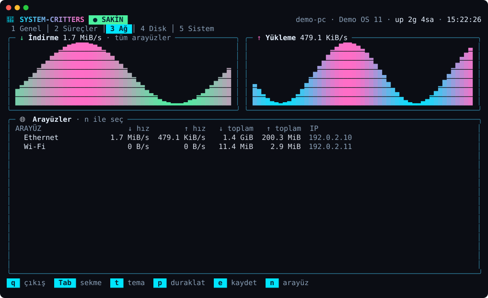
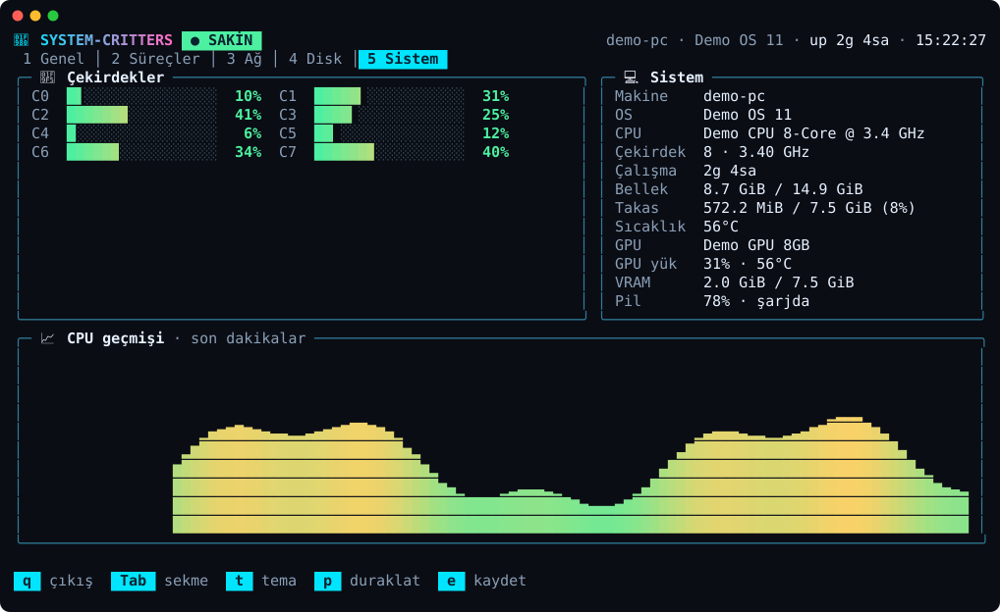

# 🦀 system-critters

Terminalinde çalışan renkli bir **sistem monitörü**. CPU, RAM, disk, ağ, süreçler,
GPU ve pil durumunu canlı gösterir; en altta ise bilgisayarının ruh haline göre
davranan küçük bir **akvaryum** yüzer.

## Ne yapar?

Tek bakışta bilgisayarının sağlığını gösterir: **CPU, RAM, disk, ağ, süreçler,
GPU ve pil** — hepsi canlı grafikler ve gradyanlı göstergelerle. Alt kısımdaki
akvaryum sistem durumuna tepki verir (CPU ↑ balıklar hızlanır, RAM ↑ sürü büyür,
ağ trafiği ↑ baloncuk artar). 5 sekme, 4 tema, yemleme/duraklatma gibi
kısayollar ve ayar dosyası içerir.


<details>
<summary>Daha fazla ekran görüntüsü</summary>

**Neon tema**


**Süreçler**


**Ağ**



**Sistem**



</details>

## Akvaryum ne anlatıyor?

| Gördüğün şey | Anlamı |
|--------------|--------|
| 🐟 Balıklar hızlı yüzüyor | CPU çok çalışıyor |
| 🐌 Balıklar yavaş | Bilgisayar boşta |
| 🐠 Akvaryum kalabalık | RAM dolu |
| 🫧 Bol baloncuk | Ağdan çok veri iniyor/gidiyor |
| 🦀 Yengeç koşturuyor | CPU yükü yüksek |
| 🔴 Balıklar kırmızı | CPU %85'i geçti |
| ♥ Mutluluk | Sistem sakinse yükselir, zorlanınca düşer; balıkları yemleyince artar |

## Nasıl çalıştırırım?

Bilgisayarında [Go](https://go.dev/dl/) (1.24+) varsa:

```bash
git clone https://github.com/mhmtemnbgr1/ILDA.git
cd ILDA
go run .
```

## Sekmeler

| Sekme | İçerik |
|-------|--------|
| **1 Genel** | CPU/RAM/Disk/Ağ kartları (gradyanlı göstergeler + son dakikaların sparkline grafiği), uyarı bandı, akvaryum |
| **2 Süreçler** | CPU / bellek / PID / isme göre sıralanabilir süreç tablosu |
| **3 Ağ** | İndirme/yükleme grafikleri, arayüz tablosu (hız, toplam veri, IP), arayüz seçimi |
| **4 Disk** | Tüm bölümler ve doluluk, okuma/yazma hızı grafikleri |
| **5 Sistem** | Çekirdek başına yük, CPU modeli/frekansı, swap, yük ortalaması, NVIDIA GPU, pil, CPU geçmişi |

> ⚠️ **Sıcaklık bazen `N/A`:** CPU sıcaklığı her makinede okunamaz (Windows'ta
> çoğu zaman ekstra sürücü gerekir). Uygulama çökmez, `N/A` yazar. GPU bilgisi
> için `nvidia-smi` gerekir; yoksa "NVIDIA bulunamadı" görünür.

## Kısayollar

| Tuş | İşlev |
|-----|-------|
| `Tab` / `Shift+Tab` / `←` `→` / `1`–`5` | sekme değiştir |
| `t` | tema değiştir (Okyanus · Neon · Retro · Şeker) — seçim kaydedilir |
| `p` / `Space` | duraklat / devam |
| `f` | balıkları yemle |
| `+` / `-` | balık sayısını artır / azalt |
| `s` | süreçleri sırala (CPU → Bellek → PID → İsim) |
| `j` `k` / `↑` `↓` / `PgUp` `PgDn` | süreç listesinde kaydır |
| `n` | ağ arayüzü seç (Ağ sekmesi) |
| `e` | anlık durumu `system-critters-<tarih>.json` olarak kaydet |
| `q` / `Esc` / `Ctrl+C` | çıkış |

Ekran küçülünce düzen otomatik sadeleşir (kartlar tek sütuna iner, akvaryum kısalır).

## Ayarlar

İlk çalıştırmada ayar dosyası oluşur (`%AppData%\system-critters\config.json`,
Linux/macOS'ta `~/.config/system-critters/config.json`):

```json
{ "theme": "Okyanus", "refresh_ms": 1000, "iface": "" }
```

- `theme`: Okyanus, Neon, Retro, Şeker
- `refresh_ms`: ölçüm sıklığı (250–10000 ms)
- `iface`: Ağ sekmesinde seçili arayüz (boş = hepsi)

## Kendine göre değiştir 🎨

- **Temalar / renkler:** `theme.go` → `themes`
- **Yeni balık türü:** `aquarium.go` → `spritesRight` (sağa bakan şekli ekle; sola bakan otomatik aynalanır)
- **Yaratık davranışı:** `aquarium.go` → `Tank.Update()`
- **Uyarı eşikleri:** `views.go` → `alerts()`

## Kendin derlemek istersen

```bash
./build.sh      # macOS / Linux
./build.ps1     # Windows (PowerShell)
```

Çıktılar `dist/` klasörüne yazılır.

## Proje yapısı

```
main.go             giriş noktası
model.go            durum, tuşlar, güncelleme döngüsü
views.go            sekmeler ve ekran düzeni
ui.go               göstergeler, grafikler, kutular, biçimlendirme
theme.go            renk temaları ve gradyanlar
config.go           ayar dosyası
stats.go            sistem bilgisi okuma (gopsutil)
gpu.go              NVIDIA GPU (nvidia-smi)
battery_*.go        pil durumu (Windows / Linux)
aquarium.go         akvaryum: balık, yengeç, yosun, yem, baloncuk
smoke_test.go       testler
```

## Kullanılan kütüphaneler

- [Bubble Tea](https://github.com/charmbracelet/bubbletea) — terminal arayüzü
- [Lip Gloss](https://github.com/charmbracelet/lipgloss) — renk ve düzen
- [gopsutil](https://github.com/shirou/gopsutil) — sistem bilgisi

## Gizlilik

Uygulama sistem değerlerini **yalnızca okur ve ekranda gösterir**; hiçbir veriyi
internete göndermez. Diske yalnızca iki şey yazar: tema/ayar dosyası ve (sen `e`
tuşuna basarsan) anlık durum JSON'u.

## Lisans

MIT — bkz. [LICENSE](LICENSE).
